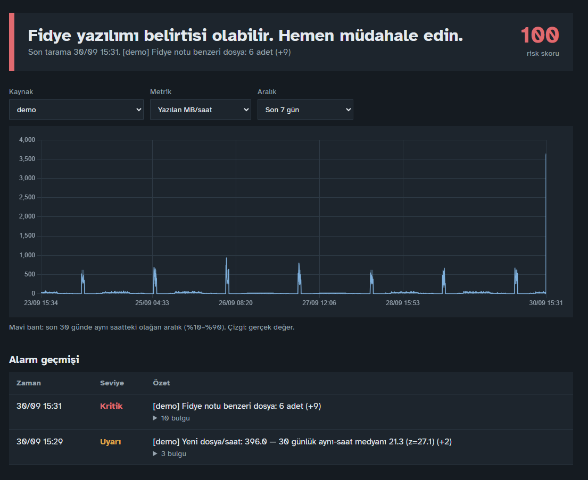
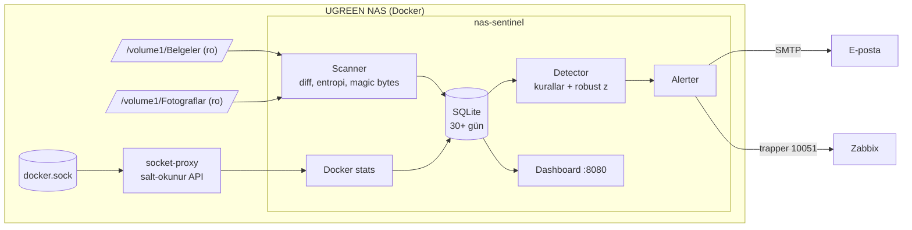
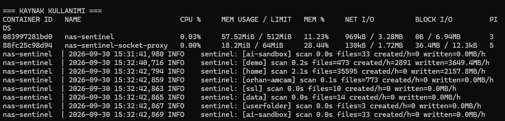
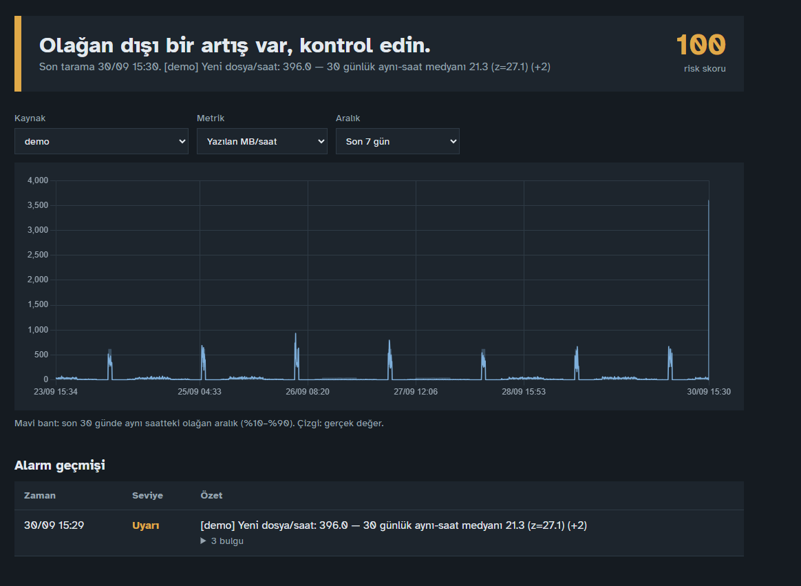
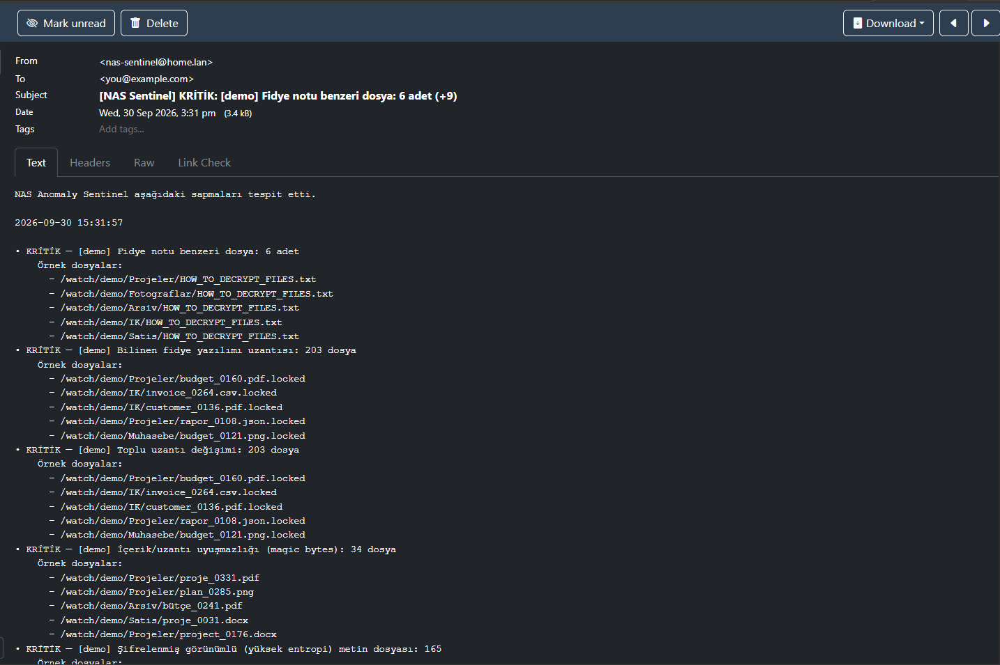
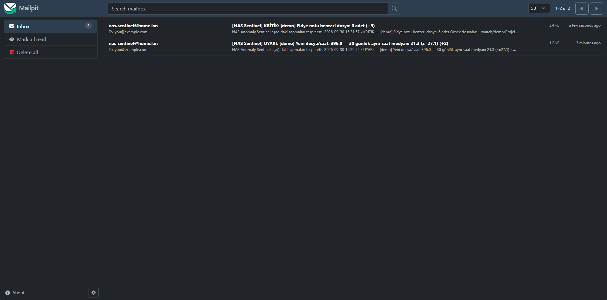

# NAS Anomaly Sentinel


Evdeki bir NAS üzerinde, tek bir Docker container ile **fidye yazılımını (ransomware) erken fark etmek** için yazılmış, açıklanabilir bir anomali tespit sistemi.

Paylaşımlı klasörlerdeki dosya hareketlerini ve container metriklerini izler, **son 30 günün aynı saatlerindeki olağan davranışı** öğrenir, sapma veya fidye yazılımı belirtisi gördüğünde **e-posta atar ve Zabbix'e bildirir.**

> **EN — in short:** A small, explainable anomaly detector for home/SMB NAS devices. It watches file activity on read-only mounted shares and Docker container stats, learns a 30-day same-hour baseline (robust z-score on median/MAD), applies ransomware heuristics (ransom notes, known extensions, bulk extension changes, magic-byte mismatch, entropy) and alerts via e-mail and Zabbix. Includes a safe, reversible ransomware simulator for demos.



---

## Neden?

Fidye yazılımı saldırılarında en pahalı şey **geç fark etmektir.** Şifreleme çoğu zaman gece ya da hafta sonu başlar; fark edildiğinde paylaşımların büyük kısmı çoktan kilitlenmiştir. Kurumsal EDR/SIEM çözümleri bu sorunu çözer ama küçük ofisler ve ev kullanıcıları için pahalı ve karmaşıktır.

Bu proje aynı fikri küçük ölçekte uygular: **"Bu NAS normalde bu saatte ne yapar?"** sorusunu 30 günlük veriden öğrenir ve olağan dışı olanı hemen söyler.

## Ne tespit eder?

| Katman | Sinyal | Seviye |
|---|---|---|
| Kural | Fidye notu benzeri dosya (`HOW_TO_DECRYPT…`, `restore_files…`) | Kritik |
| Kural | Bilinen fidye yazılımı uzantıları (`.locked`, `.lockbit`, `.deadbolt`, `.qlocker`…) | Kritik |
| Kural | Toplu uzantı değişimi (`rapor.docx → rapor.docx.locked`) | Kritik |
| Kural | Magic byte uyuşmazlığı (`.pdf` uzantılı ama `%PDF` ile başlamayan dosya) | Kritik |
| Kural | Metin dosyalarında yüksek Shannon entropisi (şifrelenmiş görünüm) | Kritik |
| İstatistik | Yeni / değişen / silinen dosya, yazılan MB, büyüme — 30 günlük aynı-saat robust z-skoru | Uyarı |
| İstatistik | Yazma **ve** silme/üzerine yazma aynı anda sıçrarsa (şifrele-ve-değiştir deseni) | Kritik |
| İstatistik | Günlük toplam büyüme, son 30 günün günlük büyümesine göre | Uyarı |
| Container | CPU, disk yazma, ağ çıkışı (veri sızdırma belirtisi) | Uyarı / Kritik |
| Canlılık | Sentinel 15 dk veri göndermezse Zabbix alarmı (saldırgan izlemeyi kapatmış olabilir) | Yüksek |

**Neden aynı saat?** Her gece 02:00'deki yedekleme 400 MB yazıyorsa bu normaldir. Aynı yazma pazar günü 14:00'te olursa normal değildir. Model bunu kendisi öğrenir, elle eşik girmeniz gerekmez.

**Neden hacim tek başına "uyarı"?** 50 GB'lık meşru bir video kopyası da büyük bir artıştır. Sistem "çok yazıldı" ile "çok yazıldı **ve** aynı anda çok dosya silindi/üzerine yazıldı" durumunu ayırır. İkincisi fidye yazılımının tipik davranışıdır.

## Mimari



Güvenlik tasarımı:

- Paylaşımlar **salt-okunur (`:ro`)** bağlanır. Sentinel hiçbir kullanıcı dosyasını değiştiremez.
- Container `read_only`, `cap_drop: ALL`, `no-new-privileges` ile çalışır. Tek yetki `DAC_READ_SEARCH` (dosya okuyabilmek).
- Docker socket'e doğrudan erişilmez. Araya yalnızca container listeleme ve istatistik okumaya izin veren [docker-socket-proxy](https://github.com/Tecnativa/docker-socket-proxy) konur.
- Tarayıcı her değişen dosyanın yalnızca ilk 64 KB'ını, sınırlı bir örneklemde okur.
- Kaynak sınırları: sentinel en fazla 0,5 çekirdek ve 512 MB RAM kullanabilir, `init: true` ile yetim süreç birikmez.

**Ne kadar yük?** Gerçek bir UGREEN NAS'taki ölçümler için aşağıdaki "Gerçek NAS'ta test" bölümüne bakın. Laboratuvar ölçümünde 200.000 dosya için tarama başına ~0,8 sn CPU ve ~110 MB RAM kullanıldı. RAM kullanımı dosya sayısıyla doğrusal artar (~1 milyon dosya ≈ 500 MB).

---

## Hızlı başlangıç: 5 dakikada simülasyon

Gereken tek şey Docker ve Docker Compose.

```bash
git clone https://github.com/sayhakilic61/nas-anomaly-sentinel.git
cd nas-anomaly-sentinel
cp .env.example .env

# 1) İmajı derle, demo sandbox'ını hazırla (400 sahte ofis dosyası)
docker compose --profile demo build
docker compose --profile demo run --rm simulator prepare --files 400

# 2) SADECE demo için 30 günlük gerçekçi geçmiş üret (mesai saatleri, hafta sonu, 02:00 yedeği).
#    Gerçek paylaşımlara seed uygulamayın; onlar kendi gerçek verisinden öğrenir.
docker compose run --rm sentinel python -m sentinel.seed --days 30 --only demo --container ctr:nextcloud

# 3) Sistemi başlat (sentinel + mail yakalayıcı)
docker compose --profile demo up -d
```

- Dashboard: `http://<nas-ip>:8080`
- Gelen alarm e-postaları (Mailpit): `http://<nas-ip>:8025`

Şimdi senaryoları sırayla çalıştırın. Her adımdan sonra bir tarama süresi (`SCAN_INTERVAL`, demoda 60 sn) bekleyin:

```bash
# Normal ofis işi -> alarm YOK
docker compose --profile demo run --rm simulator normal

# Meşru ama olağan dışı toplu kopyalama -> UYARI
docker compose --profile demo run --rm simulator bulk-copy --mb 300

# Fidye yazılımı simülasyonu -> KRİTİK + e-posta + Zabbix
docker compose --profile demo run --rm simulator ransomware --mode mixed

# Yavaş, "sinsi" saldırı (dosya başına 2 sn) -> yine KRİTİK
docker compose --profile demo run --rm simulator ransomware --mode rename --delay 2 --limit 60

# Her şeyi geri al (şifreleme geri alınabilir bir XOR'dur)
docker compose --profile demo run --rm simulator restore
```

> **Simülatör güvenli mi?** Evet. Yalnızca kendi hazırladığı ve içine `.sentinel-sandbox` işareti koyduğu klasörde çalışır, başka bir klasörde çalıştırılırsa reddeder. "Şifreleme" anahtarı bu işaret dosyasında saklanan, geri alınabilir bir XOR akışıdır. Gerçek zararlı yazılım kodu içermez.

---

## Gerçek NAS'ta test

Sistem, bir ev NAS'ında gerçek paylaşımların yanında demo sandbox ile test edildi.

| | |
|---|---|
| Donanım | UGREEN NAS, Intel N100 (4 çekirdek), 32 GB RAM, tek 2 TB HDD |
| İşletim sistemi | UGOS Pro (Debian 12), Docker 26.1 |
| İzlenen | 7 paylaşım, ~37.000 dosya, tarama aralığı 60 sn |
| Tam tarama süresi | ~2,4 sn (en büyük paylaşım 35.595 dosya: 2,1 sn) |
| Boşta CPU | %0,03 |
| RAM | 57,5 MB (socket proxy: 18 MB) |



**Senaryolar ve sonuçlar**

| Senaryo | Sonuç |
|---|---|
| Normal ofis işi (5 dosya düzenleme, 3 yeni not) | Alarm yok |
| 300 MB meşru toplu kopyalama | Uyarı: "olağan dışı artış, kontrol edin" |
| Fidye yazılımı simülasyonu (400 dosya, karışık mod) | Kritik: 6 fidye notu, 203 fidye uzantısı, 203 uzantı değişimi, 34 magic byte uyuşmazlığı, 165 yüksek entropili dosya |

Toplu kopyalama sadece uyarı üretir, çünkü yalnızca yazma artmıştır. Fidye simülasyonu ise ilk taramada kritik alarma döner:



Alarm e-postası, hangi kuralların tetiklendiğini örnek dosya yollarıyla birlikte gösterir:





**Testte bulunan gerçek bir gürültü kaynağı.** İlk çalıştırmada kişisel klasörde, dosya sayısı hiç değişmediği halde saatte ~2 GB "yazma" görüldü. Kaynağı, Uptime Kuma'nın 170 MB'lık SQLite veritabanıydı: uygulama her kontrolde birkaç KB yazıyor, ama dosyanın değişiklik zamanı güncellendiği için tamamı yazılmış sayılıyordu. Çözüm, klasörü `EXCLUDE_DIRS` listesine eklemek oldu. Aynı durum Nextcloud, Home Assistant, Plex gibi veritabanı kullanan her uygulamada yaşanabilir. Sürekli yazılan dosyaları bulmak için:

```bash
find /volume1 -type f -mmin -10 -printf '%TT  %10s  %p\n' 2>/dev/null | sort -k2 -n | tail -15
```

## Benzer senaryolar

Sentinel herhangi bir klasörü izleyebildiği için aynı yaklaşım NAS dışında da işe yarar. İzlemek istediğiniz dizini container'a `:ro` ile bağlamanız yeterli.

| Ortam | Neyi izler | Neyi yakalar |
|---|---|---|
| Dosya sunucusu (Samba/Windows paylaşımı) | Ortak klasörler | Bir istemciden yayılan şifreleme |
| Uygulama sunucusu (Nextcloud, Seafile) | Kullanıcı veri dizini | Senkronize edilen şifreli dosyalar, toplu silme |
| Web sunucusu | `uploads/`, `wwwroot/` | Beklenmedik dosya patlaması, toplu değişiklik, web sitesi bozma |
| Yedekleme hedefi | Yedek klasörü | Yedeklerin şifrelenmesi veya silinmesi (saldırganlar önce yedeği hedefler) |
| Docker ana makinesi | Container metrikleri | Olağan dışı CPU, disk yazma veya ağ çıkışı (kripto madenciliği, veri sızdırma) |

## Gerçek NAS'a kurulum (UGREEN / UGOS Pro)

1. UGOS'ta **Docker** uygulamasını kurun ve SSH'ı açın (Denetim Masası › Terminal).
2. Projeyi NAS'a alın (ör. `/volume1/docker/nas-anomaly-sentinel`).
3. `docker-compose.yml` içinde izlemek istediğiniz paylaşımları **`:ro` ile** ekleyin:
   ```yaml
   volumes:
     - /volume1/Belgeler:/watch/belgeler:ro
     - /volume1/Muhasebe:/watch/muhasebe:ro
   ```
4. `.env` dosyasını düzenleyin:
   ```ini
   WATCH_PATHS=belgeler=/watch/belgeler,muhasebe=/watch/muhasebe
   SCAN_INTERVAL=300
   SMTP_HOST=smtp.gmail.com
   SMTP_PORT=587
   SMTP_TLS=starttls
   SMTP_USER=siz@gmail.com
   SMTP_PASSWORD=uygulama-sifresi   # Gmail "Uygulama şifresi"
   MAIL_TO=siz@gmail.com
   ```
5. `docker compose up -d`
6. İlk 7 gün sistem **öğrenme modundadır:** istatistiksel katman bekler, kural katmanı ilk dakikadan aktiftir. 30. günden itibaren tam hassasiyete ulaşır.

UGOS'un Docker arayüzünden "Proje" oluşturup bu compose dosyasını yapıştırarak da kurabilirsiniz. Paylaşım yolları modele göre değişebilir, `ls /volume1` ile kontrol edin.

## Zabbix entegrasyonu

Zabbix sunucunuz yoksa demo stack'i kullanın:

```bash
docker compose --profile demo --profile zabbix up -d
# Arayüz: http://<nas-ip>:8081  kullanıcı: Admin  şifre: zabbix  (hemen değiştirin)
```

1. **Data collection › Templates › Import** ile `zabbix/template_nas_anomaly_sentinel.yaml` dosyasını içe aktarın.
2. **Data collection › Hosts › Create host**: host adı `.env` içindeki `ZABBIX_HOST` ile aynı olmalı (varsayılan `nas-sentinel`). Template'i bağlayın. Trapper item'lar için interface gerekmez.
3. `.env` içinde `ZABBIX_ENABLED=true`, `ZABBIX_SERVER=<zabbix-ip-veya-zabbix-server>`.

Sentinel her taramada şu item'ları gönderir:

| Key | Açıklama |
|---|---|
| `sentinel.status` | 0 normal, 1 uyarı, 2 kritik |
| `sentinel.score` | 0–100 risk skoru |
| `sentinel.message` | En önemli bulgunun metni |
| `sentinel.heartbeat` | Canlılık sinyali (15 dk gelmezse alarm) |

Zabbix gönderimi harici `zabbix_sender` binary'si gerektirmez. Protokol `sentinel/zabbix_sender.py` içinde saf Python ile uygulanmıştır.

## Yapılandırma

| Değişken | Varsayılan | Açıklama |
|---|---|---|
| `WATCH_PATHS` | `demo=/watch/demo` | `ad=/yol` çiftleri, virgülle |
| `SCAN_INTERVAL` | `300` | Tarama aralığı (sn) |
| `BASELINE_DAYS` | `30` | Olağan davranışın öğrenildiği pencere |
| `MIN_BASELINE_DAYS` | `7` | İstatistiğin devreye girmesi için gereken gün |
| `HOUR_WINDOW` | `1` | Aynı saat ± kaç saat karşılaştırılsın |
| `Z_WARNING` / `Z_CRITICAL` | `4` / `8` | Robust z-skoru eşikleri |
| `RULE_RANSOM_EXT` | `3` | Kaç fidye uzantısı kritik sayılır |
| `RULE_EXT_CHANGED` | `20` | Tek taramada kaç uzantı değişimi kritik sayılır |
| `RULE_MAGIC_MISMATCH` | `5` | Magic byte uyuşmazlık eşiği |
| `RULE_HIGH_ENTROPY` | `10` | Yüksek entropili metin dosyası eşiği |
| `ALERT_COOLDOWN` | `1800` | Olay başına tek e-posta: bu süre içinde aynı paylaşım için yalnızca durum kötüleşirse veya yeni bir kural tetiklenirse tekrar mail atılır (sn) |
| `ALERT_LANG` | `tr` | `tr` veya `en` |
| `ENABLE_DOCKER_STATS` | `false` | Container metriklerini topla |

## Proje yapısı

```
sentinel/
  scanner.py        dosya sistemi farkı, entropi, magic bytes, fidye notu tespiti
  detector.py       kural motoru + 30 günlük aynı-saat robust z-skoru
  alerts.py         e-posta ve Zabbix, TR/EN mesajlar, cooldown
  zabbix_sender.py  Zabbix trapper protokolü (saf Python)
  docker_stats.py   container CPU / disk / ağ metrikleri
  dashboard.py      hafif web paneli (stdlib, internet gerektirmez)
  seed.py           30 günlük gerçekçi geçmiş veri üretici
simulator/
  simulate.py       güvenli, geri alınabilir saldırı simülatörü
zabbix/             Zabbix 7.0 template
tests/              birim testleri + uçtan uca fidye simülasyonu testi
```

Testleri çalıştırmak için: `pip install pytest docker && python -m pytest -v`

## Sınırlar (dürüst notlar)

- Bu bir **erken uyarı** aracıdır, yedeğin yerini tutmaz. 3-2-1 yedekleme ve NAS'ın **değiştirilemez snapshot** özelliği hâlâ en önemli savunmadır. Sentinel size snapshot'a dönmek için **zaman** kazandırır.
- Tarama periyodiktir (varsayılan 5 dk), gerçek zamanlı değildir. Çok hızlı bir saldırıda bir tarama aralığı kadar veri etkilenebilir.
- Veritabanı dosyaları (SQLite vb.) küçük bir değişiklikte bile tamamen "yazılmış" sayılır. Uygulama veri klasörlerini `EXCLUDE_DIRS` ile dışarıda bırakın (bkz. "Gerçek NAS'ta test").
- Çok büyük paylaşımlarda (milyonlarca dosya) tarama süresi uzar. `EXCLUDE_DIRS` ile gereksiz klasörleri dışarıda bırakın veya aralığı büyütün.
- Sıkıştırılmış formatlar (jpg, zip, mp4) doğal olarak yüksek entropilidir. Bu yüzden entropi kontrolü yalnızca metin tabanlı dosyalara uygulanır, diğerleri için magic byte kontrolü kullanılır.

## Lisans

MIT. Bkz. [LICENSE](LICENSE).
